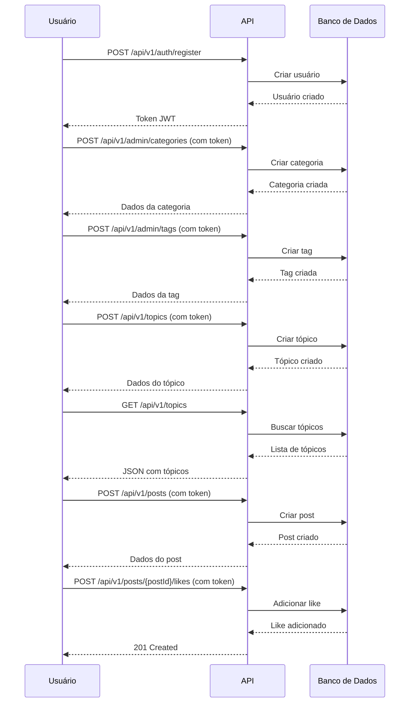

# Guia de Início Rápido - API do Fórum Web

##  Quick Start

Este guia vai ajudá-lo a começar a usar a API em menos de 5 minutos.

---

## Pré-requisitos

- Java 17 ou superior
- Maven 3.6 ou superior
- Uma ferramenta para testar APIs (Postman, Insomnia, ou cURL)

---

## 1. Iniciar a Aplicação

### Opção A: Usando Maven Wrapper (recomendado)
```bash
./mvnw spring-boot:run
```

### Opção B: Usando Maven instalado
```bash
mvn spring-boot:run
```

A aplicação estará disponível em: **http://localhost:8080**

---

## 2. Primeiro Acesso - Criando Dados Iniciais

### Passo 1: Registrar um Usuário

```bash
curl -X POST http://localhost:8080/api/v1/auth/register \
  -H "Content-Type: application/json" \
  -d '{
    "username": "admin",
    "email": "admin@forum.com",
    "password": "admin123",
    "fullName": "Administrador"
  }'
```

**Resposta esperada:**
```json
{
  "userId": 1,
  "username": "admin",
  "email": "admin@forum.com",
  "fullName": "Administrador",
  "token": "eyJhbGciOiJIUzI1NiIsInR5cCI6IkpXVCJ9...",
  "expiresAt": "2026-02-15T10:30:00Z"
}
```

 **IMPORTANTE**: Copie o `token` da resposta. Você vai precisar dele!

---

### Passo 2: Criar uma Categoria (como Admin)

```bash
curl -X POST http://localhost:8080/api/v1/admin/categories \
  -H "Content-Type: application/json" \
  -H "Authorization: Bearer SEU_TOKEN_AQUI" \
  -d '{
    "name": "Programação",
    "description": "Discussões sobre desenvolvimento de software"
  }'
```

**Resposta esperada:**
```json
{
  "id": 1,
  "name": "Programação",
  "description": "Discussões sobre desenvolvimento de software"
}
```

---

### Passo 3: Criar Tags (como Admin)

```bash
# Tag 1: Java
curl -X POST http://localhost:8080/api/v1/admin/tags \
  -H "Content-Type: application/json" \
  -H "Authorization: Bearer SEU_TOKEN_AQUI" \
  -d '{
    "name": "Java"
  }'

# Tag 2: Spring Boot
curl -X POST http://localhost:8080/api/v1/admin/tags \
  -H "Content-Type: application/json" \
  -H "Authorization: Bearer SEU_TOKEN_AQUI" \
  -d '{
    "name": "Spring Boot"
  }'
```

---

### Passo 4: Criar um Tópico

```bash
curl -X POST http://localhost:8080/api/v1/topics \
  -H "Content-Type: application/json" \
  -H "Authorization: Bearer SEU_TOKEN_AQUI" \
  -d '{
    "title": "Como configurar Spring Security?",
    "content": "Estou tendo dificuldades para configurar autenticação JWT no meu projeto Spring Boot. Alguém pode ajudar?",
    "categoryId": 1,
    "tagIds": [1, 2]
  }'
```

**Resposta esperada:**
```json
{
  "id": 1,
  "title": "Como configurar Spring Security?",
  "content": "Estou tendo dificuldades...",
  "categoryId": 1,
  "authorId": 1,
  "authorUsername": "admin",
  "tags": [
    {
      "id": 1,
      "name": "Java",
      "topicCount": 1
    },
    {
      "id": 2,
      "name": "Spring Boot",
      "topicCount": 1
    }
  ],
  "viewCount": 0,
  "postCount": 1,
  "createdAt": "2026-02-14T10:30:00Z",
  "lastActivityAt": "2026-02-14T10:30:00Z",
  "isPinned": false,
  "isClosed": false
}
```

---

### Passo 5: Adicionar uma Resposta (Post)

```bash
curl -X POST http://localhost:8080/api/v1/posts \
  -H "Content-Type: application/json" \
  -H "Authorization: Bearer SEU_TOKEN_AQUI" \
  -d '{
    "content": "Para configurar Spring Security com JWT, você precisa:\n1. Adicionar a dependência spring-boot-starter-security\n2. Criar uma classe SecurityConfig\n3. Implementar um filtro JWT\n\nVou preparar um exemplo completo para você!",
    "topicId": 1
  }'
```

---

### Passo 6: Curtir o Post

```bash
curl -X POST http://localhost:8080/api/v1/posts/2/likes \
  -H "Authorization: Bearer SEU_TOKEN_AQUI"
```

---

## 3. Testando a API

### Listar Todas as Categorias
```bash
curl http://localhost:8080/api/v1/categories
```

### Listar Todos os Tópicos
```bash
curl http://localhost:8080/api/v1/topics
```

### Ver um Tópico Específico
```bash
curl http://localhost:8080/api/v1/topics/1
```

### Listar Posts de um Tópico
```bash
curl http://localhost:8080/api/v1/posts/topic/1
```

### Contar Likes de um Post
```bash
curl http://localhost:8080/api/v1/posts/2/likes/count
```

---

## 4. Fluxo Completo de Interação



---

## 5. Collection do Postman

Para facilitar os testes, você pode importar esta collection no Postman:

### Estrutura de Pastas Sugerida:

```
 Forum API
   Auth
    - POST Register
    - POST Login
   Admin
     Categories
      - POST Create Category
      - PUT Update Category
      - DELETE Delete Category
     Tags
      - POST Create Tag
      - PUT Update Tag
      - DELETE Delete Tag
   Categories
    - GET List All
    - GET Get By ID
   Tags
    - GET List All
    - GET Get By ID
   Topics
    - POST Create Topic
    - GET List All
    - GET Get By ID
   Posts
    - POST Create Post
    - GET Get By ID
    - GET List by Topic
    - PATCH Edit Post
    - DELETE Delete Post
   Likes
    - POST Like Post
    - DELETE Unlike Post
    - GET Count Likes
   Chats
    - POST Create Chat
    - GET Get Chat
    - GET List Messages
    - POST Send Message
    - POST Join Chat
    - POST Leave Chat
    - GET Count Participants
   Users
    - GET List All
    - GET Get By ID
```

### Variáveis de Ambiente (Postman):

```json
{
  "base_url": "http://localhost:8080/api/v1",
  "token": "",
  "userId": "",
  "categoryId": "",
  "tagId": "",
  "topicId": "",
  "postId": "",
  "chatId": ""
}
```

---

## 6. Comandos úteis

### Verificar Status da API
```bash
curl http://localhost:8080/api/v1/categories
```
Se retornar um array JSON (mesmo que vazio `[]`), a API está funcionando!

### Limpar Banco de Dados (H2)
Pare a aplicação e delete o arquivo:
```bash
rm -rf .data/
```

### Ver Console do H2 (desenvolvimento)
Acesse: http://localhost:8080/h2-console
- JDBC URL: `jdbc:h2:file:./.data/database`
- Username: `sa`
- Password: (deixe vazio)

### Recompilar o Projeto
```bash
./mvnw clean install
```

---

## 7. Estrutura de Dados Essencial

### Relacionamentos:

```
User (Usuário)
  ↓ cria
Category (Categoria)
  ↓ contém
Topic (Tópico)
  ↓ possui
  ├─ Post (Resposta)
  │   ↓ recebe
  │   Like (Curtida)
  ├─ Tag (Etiqueta)
  └─ Chat (Sala de Chat)
      ↓ contém
      ChatMessage (Mensagem)
```

### IDs Importantes:

Após criar os dados iniciais, você terá:
- **User ID**: 1 (admin)
- **Category ID**: 1 (Programação)
- **Tag IDs**: 1 (Java), 2 (Spring Boot)
- **Topic ID**: 1 (primeiro tópico criado)
- **Post IDs**: 1 (post do tópico), 2 (primeira resposta)

---

## 8. Troubleshooting

### Problema: "401 Unauthorized"
**Solução**: Verifique se você incluiu o token no header:
```bash
-H "Authorization: Bearer SEU_TOKEN_AQUI"
```

### Problema: "404 Not Found"
**Solução**: Verifique se o ID do recurso existe. Liste todos os recursos primeiro:
```bash
curl http://localhost:8080/api/v1/categories
curl http://localhost:8080/api/v1/topics
```

### Problema: "400 Bad Request - Validation failed"
**Solução**: Verifique os campos obrigatórios:
- Title: 5-200 caracteres
- Content: mínimo 10 caracteres
- Name: 3-100 caracteres

### Problema: Aplicação não inicia
**Solução**: 
1. Verifique se a porta 8080 está livre:
   ```bash
   lsof -i :8080
   ```
2. Verifique os logs para erros de configuração
3. Tente limpar e recompilar:
   ```bash
   ./mvnw clean install
   ```

---

## 9. Próximos Passos

Agora que você tem a API funcionando:

1.  **Explore os Endpoints**: Teste todos os endpoints documentados em [API.md](API.md)
2.  **Crie Mais Dados**: Adicione categorias, tags e tópicos variados
3.  **Registre Múltiplos Usuários**: Teste interações entre diferentes usuários
4.  **Teste os Chats**: Crie salas de chat e envie mensagens
5.  **Desenvolva o Frontend**: Use a API para criar a interface web
6.  **Implemente Autorização**: Adicione controle de permissões refinado
7.  **Deploy**: Publique em produção (Heroku, Railway, AWS, etc.)

---

## 10. Recursos Adicionais

-  [Documentação Completa da API](API.md)
-  [Requisitos do Sistema](REQUISITOS.md)
-  [Diagrama de Classes](DIAGRAMA_DE_CLASSES.png)
-  [Wireframes](WIREFRAME-PAGINA_HOME.png)

---

##  Dicas de Desenvolvimento

### Configuração para Produção
Antes de fazer deploy, ajuste:
1. Configure CORS para origens específicas
2. Use PostgreSQL em vez de H2
3. Configure variáveis de ambiente para senhas
4. Implemente rate limiting
5. Adicione logs estruturados
6. Configure HTTPS

### Melhorias Futuras
- Implementar WebSocket para chat em tempo real
- Adicionar paginação em listas grandes
- Implementar busca full-text
- Adicionar upload de imagens
- Criar sistema de notificações
- Implementar moderação de conteúdo

---

**Dúvidas?** Consulte a [documentação completa da API](API.md) ou abra uma issue no repositório.

**Boa sorte com seu projeto! **
